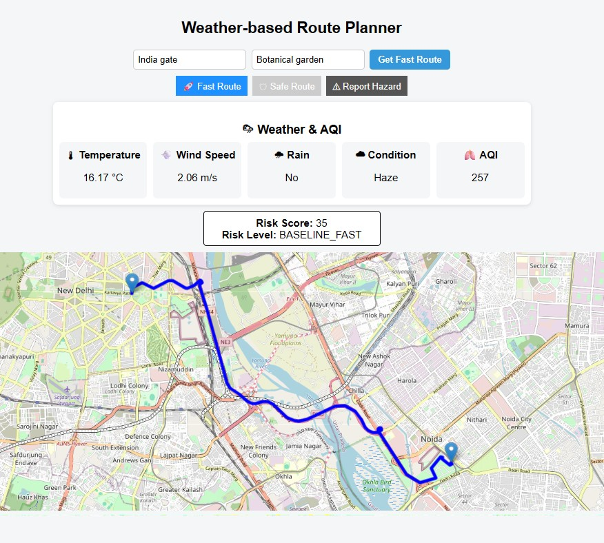
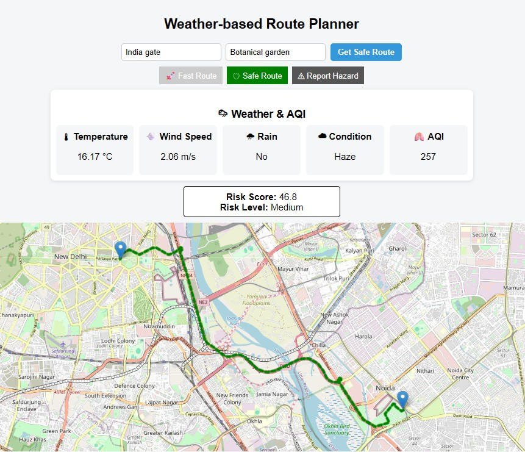
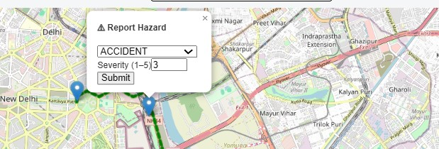

# 🌦️ Weather-Based Route Planner using Machine Learning

A full-stack web application that recommends **Fast** and **Safety-Aware** routes by integrating real-time weather conditions, air quality, machine learning-based risk prediction, crowd-sourced hazard reports, and historical accident-prone zones.

This repository accompanies the research paper:

> **Smart Weather-Aware and Safety-Optimized Route Planning Using Machine Learning and Spatial Risk Analytics**

---

# 📌 Features

- 🚀 Fast Route Recommendation
- 🛡️ Safety-Aware Route Recommendation
- 🤖 Random Forest Based Risk Prediction
- 🌦️ Real-Time Weather Monitoring
- 🌫️ Air Quality Index (AQI)
- 🚧 Crowd-Sourced Hazard Reporting
- 📍 Historical Accident-Prone Zone Analysis
- 🗺️ Interactive Leaflet Map
- ☁️ MongoDB Atlas Integration

---

# 📷 Application Preview

## Home Page


---

## Fast Route

The Fast Route prioritizes travel efficiency while considering environmental conditions.



---

## Safety-Aware Route

The Safety-Aware Route recommends routes using machine learning, environmental conditions, user-reported hazards, and historical accident-prone zones.



---

## Hazard Reporting

Users can report hazards by selecting a location on the map.

Supported hazard types:

- Accident
- Pothole
- Fog
- Water Logging
- Traffic


---

## Hazard Severity

Each reported hazard includes a severity level (1–5) which contributes to the composite safety score.



---

# 🏗️ System Architecture

```
                    React Frontend
                           │
                           ▼
                  Express.js Backend
                           │
      ┌────────────┬─────────────┬─────────────┐
      ▼            ▼             ▼             ▼
 Geoapify API  Weather API  MongoDB Atlas  Flask ML API
                                                  │
                                                  ▼
                                   Random Forest Risk Model
```

---

# 🧠 Composite Risk Calculation

## Fast Route

Environmental risk only.

```
R_fast = min(
100,
AQI Penalty +
Visibility Penalty +
Rain Penalty +
Wind Penalty
)
```

---

## Safety-Aware Route

```
R_safe = min(
100,
0.6 × ML Risk +
AQI Penalty +
Visibility Penalty +
Rain Penalty +
Wind Penalty +
Hazard Penalty +
Zone Penalty
)
```

---

# 💻 Technology Stack

### Frontend

- React.js
- React Leaflet
- Leaflet
- Axios
- CSS

### Backend

- Node.js
- Express.js
- MongoDB Atlas
- Mongoose

### Machine Learning

- Python
- Flask
- Scikit-learn
- Random Forest Regressor

### APIs

- Geoapify Geocoding API
- Geoapify Routing API
- OpenWeatherMap API

---

# 📁 Project Structure

```
weather-route-planner-ml
│
├── backend/
│
├── frontend/
│
├── ml/
│   ├── api/
│   ├── data/
│   ├── experiments/
│   ├── models/
│   └── train_model.py
│
├── docs/
│   └── images/
│
└── README.md
```

---

# 🤖 Machine Learning

**Model**

- Random Forest Regressor

**Training Dataset**

- 1500 records

**Input Features**

- Weather Condition
- Road Type
- Road Surface

**Performance**

| Metric | Value |
|---------|--------|
| MAE | 0.9607 |
| RMSE | 1.1376 |
| R² Score | 0.828 |
| Classification Accuracy | 78.67% |

---

# 📊 Dataset

The processed dataset used during model development is included in:

```
ml/data/processed/
```

Historical accident-prone zones were manually prepared from the publicly available **Delhi Traffic Police Accident-Prone Locations Report (2021)**.

---

# ⚙️ Installation

## Clone Repository

```bash
git clone https://github.com/thesurajcode/weather-route-planner-ml.git
cd weather-route-planner-ml
```

---

## Backend

```bash
cd backend
npm install
npm start
```

Server:

```
http://localhost:5000
```

---

## Frontend

```bash
cd frontend
npm install
npm run dev
```

Server:

```
http://localhost:5173
```

---

## Machine Learning Service

```bash
cd ml
pip install -r requirements.txt
python api/app.py
```

Server:

```
http://127.0.0.1:5001
```

---

# 🔐 Environment Variables

Create a `.env` file inside the `backend` folder.

```env
PORT=5000

MONGO_URI=your_mongodb_connection_string

GEOAPIFY_API_KEY=your_geoapify_api_key

OPENWEATHERMAP_API_KEY=your_openweather_api_key
```

---

# 👥 Contributors

### Suraj Kumar
- Full Stack Development
- Machine Learning Integration
- Backend Development
- Research & Implementation

### Anam Aaliya
- Project Contributor

---

# 📖 Research Contribution

This work proposes a safety-aware navigation framework that combines:

- Machine Learning Risk Prediction
- Real-Time Weather Information
- Air Quality Index (AQI)
- Crowd-Sourced Hazard Reports
- Historical Accident-Prone Zones

Unlike traditional navigation systems that primarily optimize travel time, this framework recommends routes by balancing both efficiency and safety.

---

# 🚀 Future Work

- Live Traffic Integration
- User Authentication
- Mobile Application
- Dynamic Route Recalculation
- Road Closure Detection
- Deep Learning Risk Prediction
- Hazard Verification System

---

# 📚 Associated Research

**Smart Weather-Aware and Safety-Optimized Route Planning Using Machine Learning and Spatial Risk Analytics**

---

# 📄 License

This project is intended for academic and research purposes.